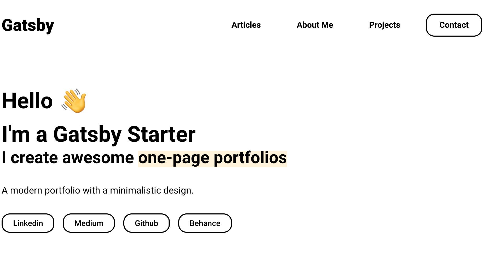

## Installation

1. Install the Gatsby CLI

   ```sh
   npm install -g gatsby-cli
   ```


3. Once installed, you can begin developing your site.

   ```sh
   cd portfolio-minimal
   gatsby develop
   ```

