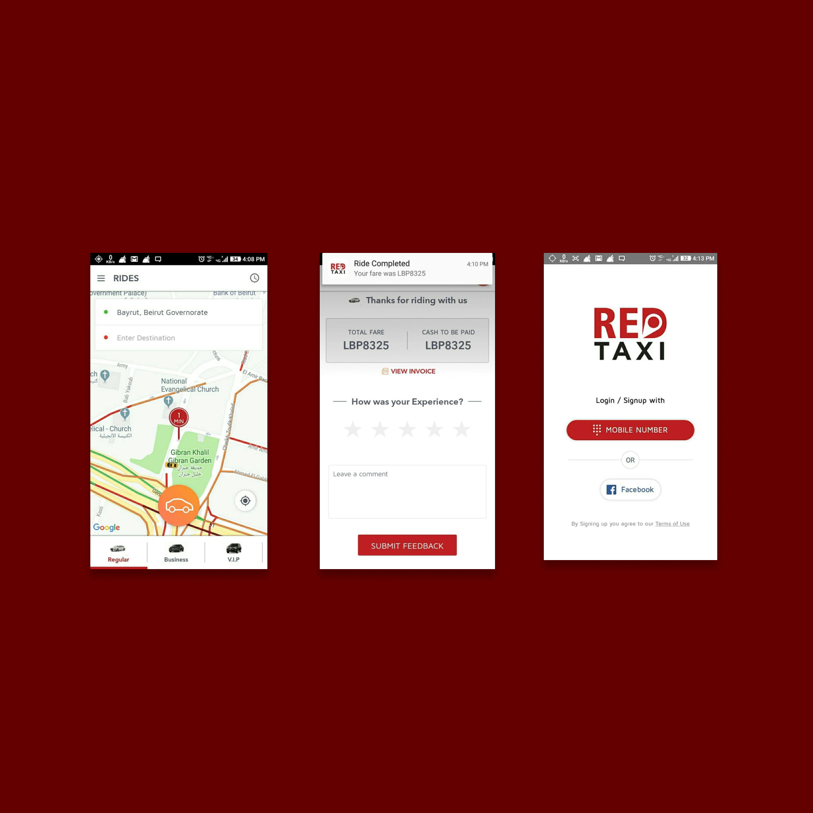

this project was built in collaboration between <u><a href="https://cubeta.io/">CUBETA</a></u> and Inkcode lebanon
## Scope of project

This software is an on-demand transportation platform.
The system allows users can register,manage their account,request a ride and manage their ride's status 
Furthermore, the platform enables drivers to manage their account,check-in to a car from the company's fleet using a qr code unique for each car, accept rides and manage them through the driver's app.
Additionally, the platform allows admins to monitor and manage all the functionality on the platform including users management, ride management, and many reports

### Responsibilities

- lead the web team
- built the admin dashboard
- realtime communications using websockets
- analayzed business logic
- written backlog
- sprint planning
- acted as the bridge between the client, the mobile and web teams and the client
- backend debugging

#### Links

<u><a href="https://redtaxi.cab/">Website</a></u>
<u><a href="https://play.google.com/store/apps/details?id=com.customer.redtaxi">Play Store</a></u>
<u><a href="https://apps.apple.com/lb/app/red-taxi-lb/id1481695744">App Store</a></u>

