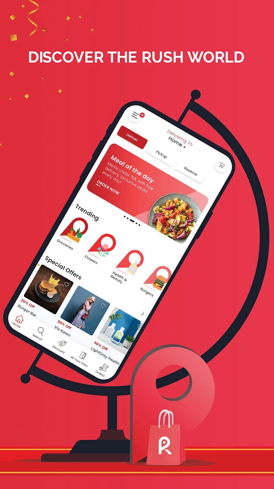
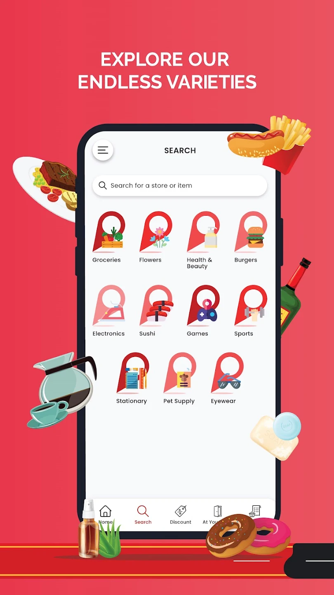

this project was built in collaboration between <u><a href="https://cubeta.io/">CUBETA</a></u> and Inkcode

## Scope of project

This software is an on-demand delivery service. This 
system is designed to maximise the client’s productivity by 
providing tools to assist in handling the workflow of the ordering 
and delivery of products, door to door delivery,package delivery, 
coupons, discounts and restaurant reservations.
Furthermore, the system provides loyalty program functionality 
through elements of gamification where users earn points by 
using the system

### Responsibilities

- lead the web team
- analayzed business logic
- written backlog
- sprint planning
- maintained the project backlog
- acted as the bridge between the client and the technical team
- backend debugging
- implemented localisation in nextjs app
- API design
- final testing

#### Links

<u><a href="https://redrush.co/">Website</a></u>
<u><a href="https://play.google.com/store/apps/details?id=co.redrush.client">Play Store</a></u>
<u><a href="https://apps.apple.com/lb/app/rush-food-grocery-delivery/id1590468108">App Store</a></u>

